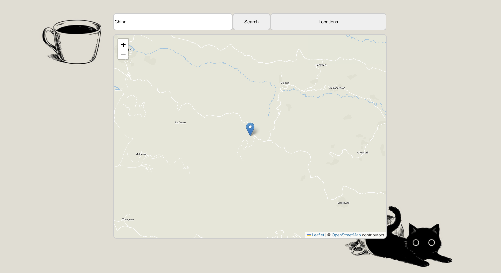

  

Full Guide To Run! : https://docs.google.com/document/d/1H0vtFodZGIdxKDPshzHj7TCVLIJ3Ue_GKfedihymlRg/edit
 
Necessary downloads:
 
yarn add react react-dom leaflet
 
yarn add react-leaflet
 
yarn add -D @types/leaflet
 
Links/Documentations used in creating this project:
 
Below is a link to the documentation for openstreetmap!
 
https://react-leaflet.js.org/docs/start-introduction/ 
 
This will be the api utilized in Search.tsx to search for specific locations!
 
https://nominatim.org/release-docs/develop/api/Overview/

